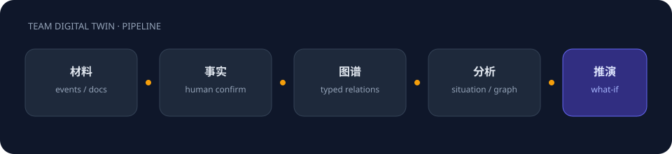
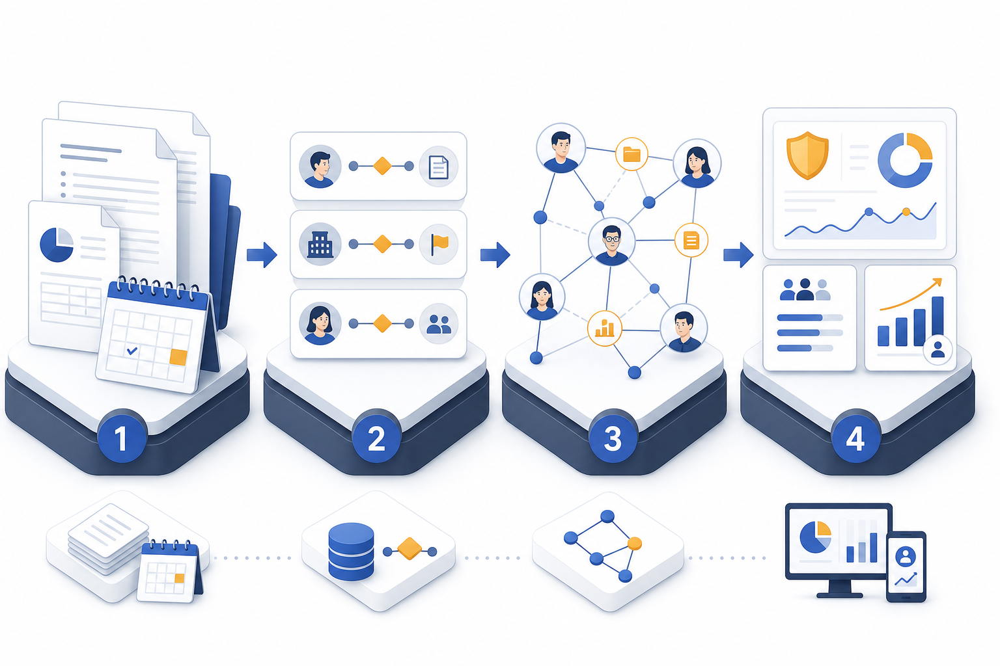

# 团队数字孪生 · Team Digital Twin

**把「发生了什么」变成可追溯的组织记忆，再据此看关系、带人、做推演。**

A workplace digital twin: **evidence → facts → knowledge graph → insight**.  
Not another chatbot on top of an org chart.

<p align="center">
  
</p>

<p align="center">
  <em>研究型开源原型：用事实治理约束知识图谱，拦住「负责人 = 全能」「上级 = 导师」。</em>
</p>

<p align="center">
  <a href="docs/scenarios-and-storylines.md"><strong>场景与预期</strong></a>
  ·
  <a href="#快速开始"><strong>Quick start</strong></a>
  ·
  <a href="docs/ontology-governance-confirmation-spec.md"><strong>本体确认规范</strong></a>
</p>

---

## 为什么要做这个

企业知识图谱很容易把职场画成一张漂亮的**错误网**：

- 编制上「负责」项目 → 被推成做了全部技术
- 向谁汇报 → 被推成培养了谁
- 成果挂在谁名下 → 被推成谁创造了成果

真实组织不是这样。领导可以管理、汇报、对成果有组织归属；工程师可以执行、做架构、把系统送上线——**两件事必须能同时成立，并且不能互相偷换**。

本项目把职场数字孪生拆成一条可审计流水线。LLM 只抽取候选，**写图谱必须人确认**：

<p align="center">
  
</p>

<p align="center">
  
</p>

**总规则：** 事实可以证明事实；事实不能跨语义域无条件推理。

| 不等于 | |
|---|---|
| 负责项目 | 实际完成项目 |
| 成果归属 | 实际贡献 |
| 成果汇报 | 成果创造 |
| 管理下属 | 培养下属 |
| 项目成功 | 负责人具备全部项目能力 |
| 职位高 | 能力高 |

<p align="center">
  
</p>

<p align="center">
  <sub>同一成果可以「归领导」，技术贡献仍记在做架构的人身上。</sub>
</p>

---

## 主干故事（开源演示用）

产品线要上线「AI 客服一期」。编制上领导 A 是项目负责人，工程师 B 做架构和核心开发。领导每周向业务汇报进度，同时也是 B 的上级。

| 人 | 系统应记下 | 系统不得自动记下 |
|---|---|---|
| 领导 A | 管理责任、汇报责任、成果归属 | 技术贡献、培养了 B |
| 工程师 B | 执行责任、技术 / 架构贡献 | 「没当 OWNER 所以能力为零」 |

逐步操作、每个页面「应该看到什么」、以及 10 分钟演示脚本，都写在 **[docs/scenarios-and-storylines.md](docs/scenarios-and-storylines.md)**。

---

## 你能用它做什么

界面按管理工作流分组，而不是按技术模块堆砌。

| 分组 | 页面 | 用来干什么 |
|---|---|---|
| **看团队** | 团队态势 · 总览 · 日历 · 日报 | 今天稳不稳、哪天发生过什么、关系与投入 |
| **做项目** | 项目中心 | 把交付、卡点、复盘记进同一条证据链 |
| **带人成长** | 新人地图 · 干部成长 · 向上协同 · 角色卡 · 晋升领导 | 带教、授权、准备度——全部要证据 |
| **看关系** | 人物关系网 · 事实管理 · 实体治理 · 本体治理 · 时间轴 | 图谱怎么来的、能不能改、有没有乱推 |
| **推演** | 模拟实验室 · 智能对话 | 「如果我带新人 / 负责项目 / 晋升 / 有人离开」 |
| **配置** | 成员管理 | 人设只影响推演话术，不能单独当能力证明 |

全局 **记录事件**：先写发生了什么 → 进日历 → 生成待确认事实 → 你点确认才写图。

---

## 和「再包一层 ChatGPT」有什么不一样

1. **事实层是一等公民。** 图谱边和分析结果都要能指回 Fact（来源、原文、时间、置信度）。已确认事实不原地改写，走替代或软删，并让下游先失效。
2. **责任被拆开。** `组织责任 / 执行责任 / 管理责任 / 汇报责任`，外加成果归属、贡献实例、培养行为、能力证据。
3. **推理默认禁止跨域。** 本体治理会把「从汇报推出培养、从 OWNER 推出贡献」打成撤销工单；未确认推断不进默认影响力 / 晋升计算。
4. **推演以规则 + 证据为主。** 模拟实验室先算再让模型写摘要，避免「模型打了个 87 分」却说不清依据。

这些是研究假设，不是已经在生产环境替你做绩效的系统。请把它当成 **可审计的组织记忆实验床**。

---

## 架构

```
React + Tailwind + Vite          FastAPI + SQLite
人物关系 / 事实 / 态势 / 推演  ←→  事件溯源 · 事实治理 · 本体规则
        │                              │
        │                         可选 Neo4j
        ▼
  OpenAI 兼容网关（默认硅基流动 DeepSeek）
  抽取 V3 · 推演 R1 · 问答 V3
  无 Key 时自动降级为规则 / Mock，页面仍可点通
```

| 层 | 技术 |
|---|---|
| 前端 | React 18、Vite、Tailwind CSS、FullCalendar |
| 后端 | FastAPI、Pydantic、SQLite（事件、事实、本体） |
| 图存储 | SQLite 默认可跑通；[docker-compose.yml](docker-compose.yml) 可挂 Neo4j 5 |
| 模型 | OpenAI 兼容客户端，默认硅基流动 DeepSeek |

---

## 快速开始

**需要：** Python 3.9+（推荐 3.11）、Node.js 18+。

### 1. 后端

```bash
cd backend
python -m venv .venv
# Windows: .venv\Scripts\activate
# macOS / Linux: source .venv/bin/activate
pip install -r requirements.txt
cp .env.example .env          # 可选：填入 SILICONFLOW_API_KEY
python main.py                # http://127.0.0.1:8000
```

macOS / Linux 也可在仓库根目录执行 `./start.sh`（启动后端，并提示你另开终端跑前端）。

### 2. 前端

```bash
cd frontend
npm install
npm run dev                   # http://localhost:5173
```

### 3. 可选：Neo4j

```bash
docker compose up -d          # 浏览器 http://localhost:7474
# 默认用户 neo4j / 密码见 docker-compose.yml
```

不配 Neo4j 时图谱走 SQLite，功能可完整演示。

### 4. 第一次打开建议

1. **成员管理** 建几个人（仓库不预置 Mock 人设）。
2. 右下角 **记录事件**，写一条上线或指导。
3. **事实管理** 确认待确认事实（把「负责」拆开）。
4. **人物关系网 / 团队态势 / 模拟实验室** 看分析是否还在偷换概念。

对照预期：[场景与故事线](docs/scenarios-and-storylines.md)。

---

## 配置

复制 `backend/.env.example` 为 `backend/.env`。

| 变量 | 含义 | 默认 |
|---|---|---|
| `SILICONFLOW_API_KEY` | 硅基流动 Key，空则降级 | 空 |
| `SILICONFLOW_BASE_URL` | API 根路径 | `https://api.siliconflow.cn/v1` |
| `DEEPSEEK_MODEL_EXTRACT` | 抽取 | `deepseek-ai/DeepSeek-V3` |
| `DEEPSEEK_MODEL_SIMULATE` | 推演 | `deepseek-ai/DeepSeek-R1` |
| `DEEPSEEK_MODEL_CHAT` | 问答 | `deepseek-ai/DeepSeek-V3` |
| `NEO4J_URI` / `USER` / `PASSWORD` | 可选图数据库 | 见 `.env.example` |

Key 在 [硅基流动](https://cloud.siliconflow.cn/) 申请。也可以把 Base URL 指到任何 OpenAI 兼容网关，并改模型名。

---

## 仓库地图

```
team-digital-twin/
├── README.md
├── docs/                          # 场景预期、本体规范、宣传图
├── docker-compose.yml             # 可选 Neo4j
├── start.sh                       # 启动后端
├── backend/                       # FastAPI
│   ├── main.py
│   ├── fact_governance/           # 事实：确认写图、禁止原地改
│   ├── knowledge_governance/      # 本体、禁止跨域推理、工单
│   ├── organization_graph/        # 图谱构建与算法
│   ├── growth/ · team_situation/ · promotion/ · twin/
│   └── .env.example
└── frontend/                      # React SPA
    └── src/components/            # 与侧边栏一一对应
```

---

## 文档

- [场景与故事线 · 预期清单](docs/scenarios-and-storylines.md) — 演示、验收、开源宣传的主文档
- [本体治理确认规范](docs/ontology-governance-confirmation-spec.md) — 工单、回放、不改节点 `type`
- [文档目录](docs/README.md)
- [宣传图说明](docs/assets/README.md)

---

## 开源说明

这是一个**可运行的研究原型**，适合：

- 组织智能 / 知识图谱 / 数字孪生方向的论文与课程实验
- 想把「AI 管人」做成可审计流水线、而不是提示词玩具的团队
- 对「贡献被领导汇报吃掉」这类职场语义问题感兴趣的产品研究者

欢迎 Issue / PR：修非法推理、补场景预期、改进无 Key 降级体验、加更多可复现的故事线数据。

**请不要把本系统的分数、圈层或晋升推演当作正式绩效考核或人事处分依据。**

许可协议将在正式公开仓库时给出（计划使用宽松的 OSI 许可）。在此之前，代码仅供学习与协作讨论。

---

## 致谢

抽取与推演默认走 DeepSeek 系列（经硅基流动）。图算法、时态事实和本体工单，是为了让模型**少做它不该做的决定**。
