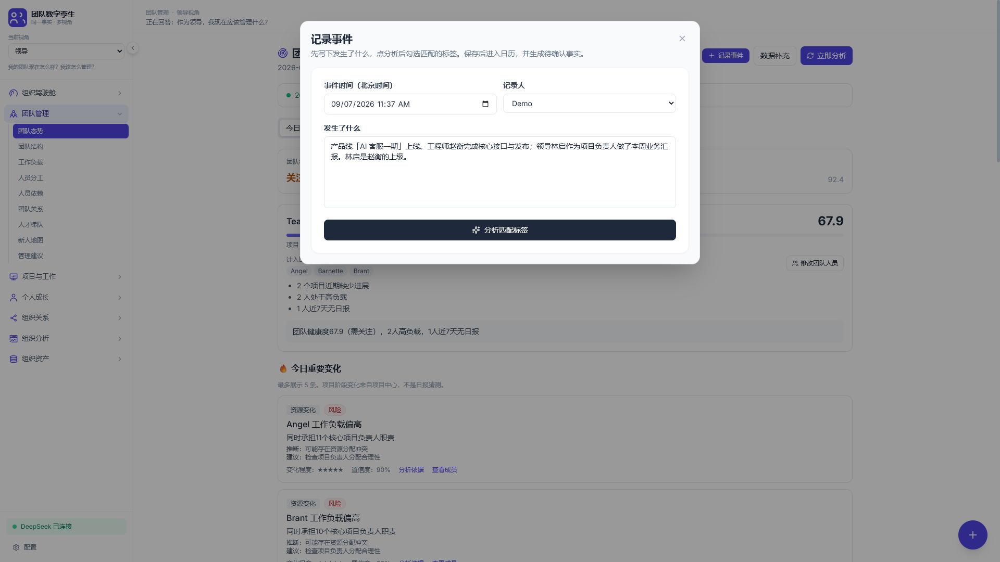
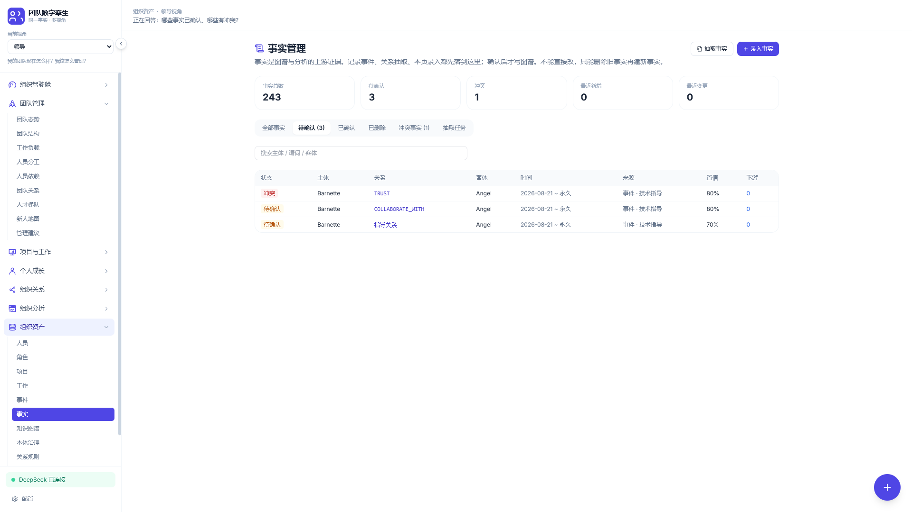
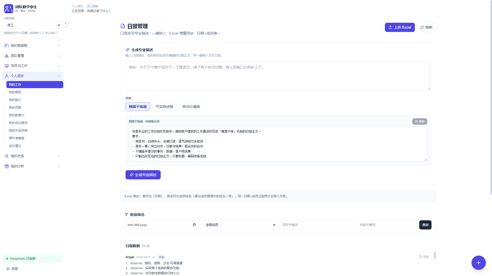
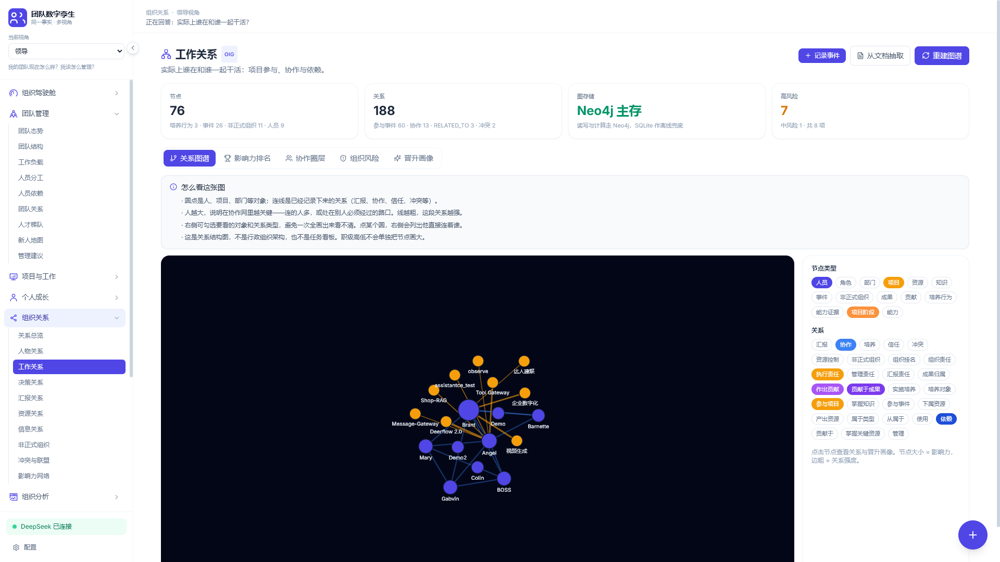
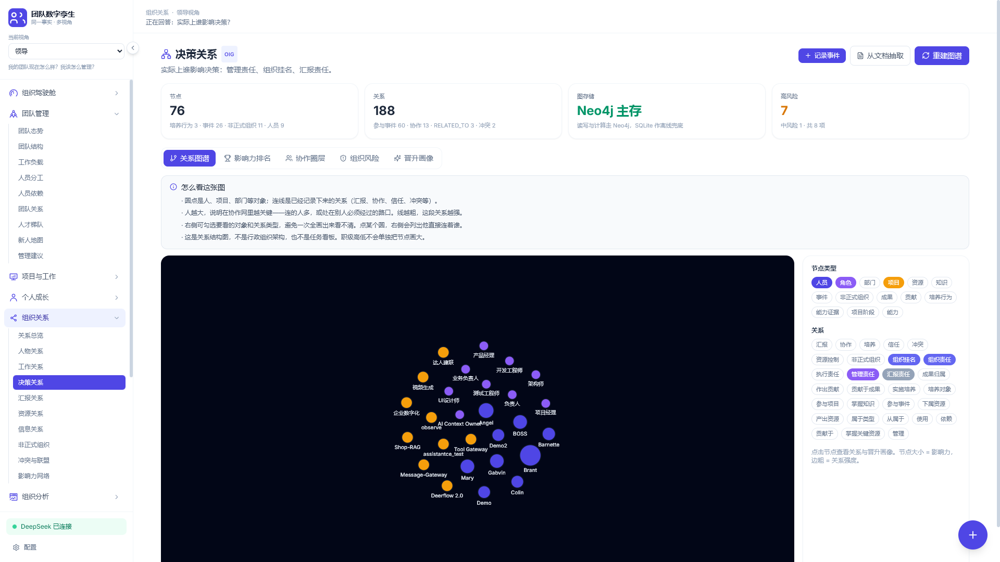

# 爱发电上线包：配图 + 文案

按这个包准备图、按顺序发动态即可。主页：https://afdian.com/a/lyc-rabbit

原则：封面用概念图，动态用实机。同一条故事：**领导挂名，工程师上线；不许把贡献记给挂名的人，也不许从「上级」推出「培养」。**

实机来自 `http://localhost:5173/`。**图里有真实成员名和项目名，发爱发电前请打码。** 当前待确认事实是协作 / 信任 / 指导，还不是「林启挂名 / 赵衡执行」那条拆分。

---

## 作品集封面 / 主页封面 · C1


| 字段 | 粘贴 |
|---|---|
| 标题 | `团队数字孪生 · 开发日志` |
| 封面 | 上面这张 |
| 简介 | `开源职场数字孪生。事件 → 人确认的事实 → 图谱 → 推演。拦住「负责人=全能」「上级=导师」。` |

四条动态都加进这一个集。主页大封面也用这张。

---

## 动态：按 ①②③④ 顺序发

新的在上面，所以 **① 先发、④ 最后发**。

---

### ① 公开 · 这是什么

**可见：** 所有人  
**目的：** 证明能跑、仓库在哪、不是空壳

**按这个顺序上传：**

先记下发生了什么。大模型只抽候选，你点确认才写图。



「负责」必须拆开。挂名不是贡献。



换谁来看，事实不换。



可垫封面：


**标题**

```
团队数字孪生：先记下真正发生了什么
```

**正文**

```
个人在做开源项目「团队数字孪生」。

通讯录、OKR、再包一层 ChatGPT，最后经常画出一张漂亮的错误网：
负责人被当成做了全部技术，上级被当成导师，挂名吃掉贡献。

我把它做成一条可审计流水线：
事件 → 人确认的事实 → 组织知识图谱 → 态势与推演。
大模型只抽候选，写进图谱必须人点头。

同一套事实：老板看风险，领导看团队，项目看交付，员工看成长。

仓库（始终免费）：
https://github.com/lyc-rabbit/team-digital-twin

爱发电用来覆盖服务器、模型调用和持续开发。
代码不锁。欢迎 Issue / PR，也欢迎请杯咖啡。
```

---

### ② 公开 · 痛点（转化核心）

**可见：** 所有人  
**目的：** 让人认同「该支持」。实机必须在概念图前面。

**按这个顺序上传：**


A 管事、B 做事。上级不会自动变成导师。





概念图只能放在实机后面当比喻：


**标题**

```
负责人 ≠ 做了全部技术
```

**正文**

```
编制上领导林启是项目负责人，工程师赵衡把「AI 客服一期」送上线。
林启每周汇报，还是赵衡的上级。

很多「组织智能」会自动记下：
· 林启做了全部技术
· 林启培养了赵衡
· 赵衡没当 OWNER，所以能力为零

这些全是错的。

系统可以记林启的管理和汇报，也可以把成果归在他名下；
但不能自动说他做了技术、他培养了下属。
贡献仍记在做架构的人身上。

上图是实机：事实确认时把「负责」拆开；工作关系里是赵衡在执行，决策关系里才是林启在挂名和管理。没有「上级 = 导师」。

如果你也烦「AI 管人」只会编分、不会讲证据——
过来一起写，或在这里发一笔电，让它继续做下去。

仓库：https://github.com/lyc-rabbit/team-digital-twin
```

---

### ③ 赞助可见 · 第 0 期进展

**可见：** 一起盯着做（28）及以上  
**9.9 请杯咖啡不要解锁这条**  
**公开预览：** `第 0 期：现在做到哪、下一步请你拍板。`  
**目的：** 发电当下就有东西看

**按这个顺序上传：**


可垫流水线：


**标题**

```
开发日志 0 · 现在做到哪，下一步拍哪条
```

**正文**

```
这是「一起盯着做 / 认真撑这个项目」可见的第一期。

【已经能演示】
· 四种视角：老板 / 领导 / 项目负责人 / 员工
· 记录事件 → 待确认事实 → 人点头才写图
· 责任拆开：组织 / 执行 / 管理 / 汇报，贡献 ≠ 挂名
· 模拟实验室：准备度先算再写摘要，不靠模型打神秘分
· 无 API Key 也能点通演示

【仓库】
https://github.com/lyc-rabbit/team-digital-twin

【下一步（请留言 1 / 2 / 3）】
1. 补一条可复现的「非法推理」故事，专门拦「汇报=培养」
2. 把无 Key 演示打磨到路演能直接点
3. 把「AI 客服一期」做成对外 10 分钟标准脚本

你的票我会按这个做。一个人在做，承诺的是优先级，不是 7×24。
推演分数不能当正式绩效或人事依据。
```

---

### ④ 公开 · 转化（最后发，压在最上面）

**可见：** 所有人  
**目的：** 去掉「该点哪一档、会不会被锁代码」的犹豫  
三档封面若还没有，这条可以不配实机。

**标题**

```
为什么在这里发电，以及三档怎么选
```

**正文**

```
项目开源，功能不锁。
发电不是买软件，是让一个人能把「拦住错误组织推理」持续做下去。

钱会用于：
· 服务器和模型调用
· 把演示、文档、非法推理用例补完整
· 有余力再做你投票出来的下一条故事线

怎么选：
· 9.9「请杯咖啡」：留个名字，知道有人在用
· 28「一起盯着做」：每月能看进展，也能对下一步投票
· 98「认真撑这个项目」：你的场景和 Issue 我会优先处理

不想露名，发电后私信我说一声。
主页：https://afdian.com/a/lyc-rabbit
仓库：https://github.com/lyc-rabbit/team-digital-twin
```

---

## 图怎么对应

| 图 | 文件 | 用在 |
|---|---|---|
| C1 | `hero-team-digital-twin.png` | 作品集 / 主页封面、动态①垫底 |
| C2 | `story-ownership-vs-contribution.png` | 动态②最后一张比喻 |
| C3 | `layers-evidence-to-insight.png` | 动态③垫底 |
| S1 | `shot-01-record-event.png` | 动态① |
| S2 | `shot-02-facts-split.png` | 动态①、动态②主图 |
| S3a | `shot-03a-graph-work.png` | 动态②、③ |
| S3b | `shot-03b-graph-decision.png` | 动态②、③ |
| S4 | `shot-04-observer-or-sim.png` | 动态①、③ |

`pipeline.svg` 给 README 用，爱发电不要发 SVG。
